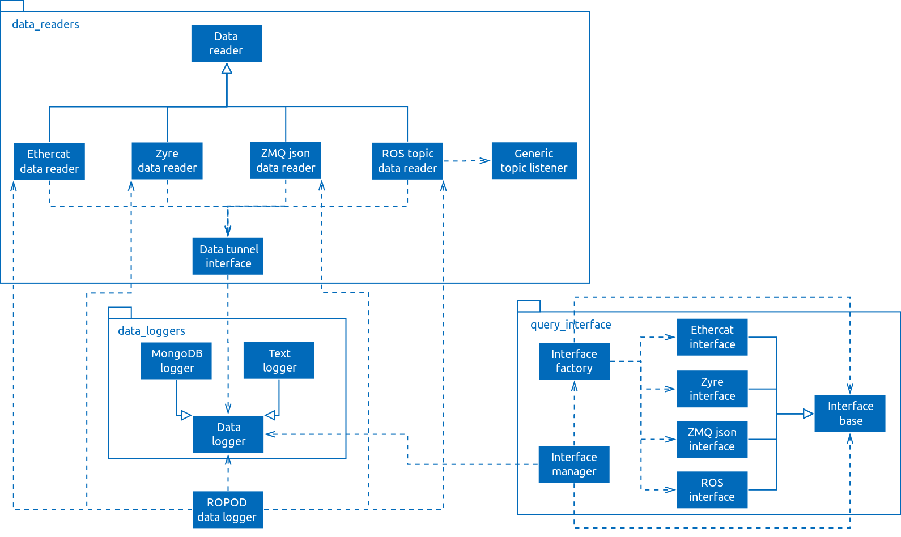

# ROPOD Black Box

## Introduction

This repository is a collection of components for ROPOD's black box, which is a device that logs data from different data sources and exposes a query interface for the data.

The black box has two major components:
* `datalogger`: A set of interfaces for reading data from different data sources and logging those data.
* `query_interface`: An interface for black box data retrieval.

## Black Box Design Principles

The main design principles of our robotics black box are:
* standard data format
* data filtering
* configurability

Our black box design principles were initially introduced in

A. Mitrevski, S. Thoduka, A. Ortega Sáinz, M. Schöbel, P. Nagel, P. G. Plöger, and E. Prassler, "Deploying Robots in Everyday Environments: Towards Dependable and Practical Robotic Systems," in 29th International Workshop on Principles of Diagnosis (DX), Warsaw, Poland, 2018.

### Data Format

The black box stores data in a custom standard format, such that
1. **all data types are logged at a single level of abstraction (i.e. in an unrolled manner) regardless of the complexity of the logged data type** and
2. **logged data are always associated with a timestamp**

This is best illustrated by an example. If we want to log a ROS topic of type [geometry_msgs/Pose](http://docs.ros.org/lunar/api/geometry_msgs/html/msg/Pose.html), which is defined as

```
geometry_msgs/Point position
    float64 x
    float64 y
    float64 z
geometry_msgs/Quaternion orientation
    float64 x
    float64 y
    float64 z
    float64 w
```

the logged data will have the following format:

```
double timestamp
double position/x
double position/y
double position/z
double orientation/x
double orientation/y
double orientation/z
double orientation/w
```

where the `/` is used for separating the different levels of abstraction of the underlying data type.

The black box uses a MongoDB database for logging data, such that each data type is stored in a separate collection and data items belonging to that data type are stored in separate documents for each time step. In the above example, the items of the geometry_msgs/Pose message will be stored in a collection named `ros_topic-name`, where `topic-name` is the name of the logged ROS topic, `ros` describes the data source (in this case ROS) and, by convention, the `_` separates the data source and data type names. The full names of the logged variables will thus be

```
ros_cmd_vel/timestamp
ros_cmd_vel/position/x
ros_cmd_vel/position/y
ros_cmd_vel/position/z
ros_cmd_vel/orientation/x
ros_cmd_vel/orientation/y
ros_cmd_vel/orientation/z
ros_cmd_vel/orientation/w
```

### Data Filtering and Configurability

In order to deal with data that come from different sources (e.g. ROS, EtherCAT, Zyre) and have different formats, each data source is associated with its own data filter that converts the data into the previously described standard format and allows data preprocessing/filtering. These filters are configured through a configuration file, an example of which can be found in [config/data_sources.yaml](config/data_sources.yaml).

### Query Interface

Data from the black box can be retrieved through a Zyre-based query interface that listens to JSON-based messages. The following message types can be sent to the query interface:
* name query: returns a list of black box Zyre nodes (schema defined in [docs/messages/black-box-name-query-schema.json](docs/messages/black-box-name-query-schema.json))
* variable query: returns a list of all variables logged on a particular black box (schema defined in[docs/messages/black-box-variable-query-schema.json](docs/messages/black-box-variable-query-schema.json))
* data query: returns data corresponding to a set of variables in a given time interval (schema defined in [docs/messages/black-box-data-query-schema.json](docs/messages/black-box-data-query-schema.json))

## Dependencies

The black box components depend on the following packages:
* `yaml-cpp`
* Several ROS components: `roscpp`, `topic_tools`, `std_msgs`, `geometry_msgs`, `nav_msgs`, and `sensor_msgs`
* `jsoncpp`
* `MongoDB` and the `MongoDB C++` driver
* `zyre`
* `zmq`
* `libtins`
* `pthread`

## Class diagrams

A UML-like diagram of the major data logger components is given below; the diagram is not exactly UML because the boxes contain more casual versions of the actual class names.



## Compiling and Running

The two major black box components - the data logger and the query interface - are compiled separately.

### datalogger

To compile the data logger, run the following commands:

```
cd datalogger
mkdir build && cd build && cmake ..
make
```

This will create one library - `libdatalogger.so` - and an executable `black_box_logger`.

To launch the data logger, run the command

```
./black_box_logger
```

inside the previously created `build` directory.

### query_interface

To compile the query interface, run the following commands:

```
cd query_interface
mkdir build && cd build && cmake ..
make
```

This will create one library - `libdata_query_interface.so` - and an executable `black_box_query_interface`.

To launch the component monitors, run the command

```
./black_box_query_interface
```

inside the previously created `build` directory.
